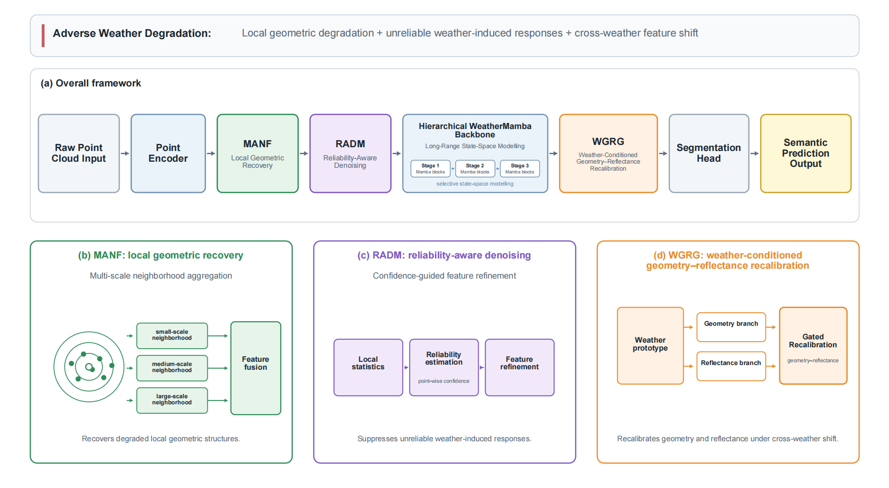
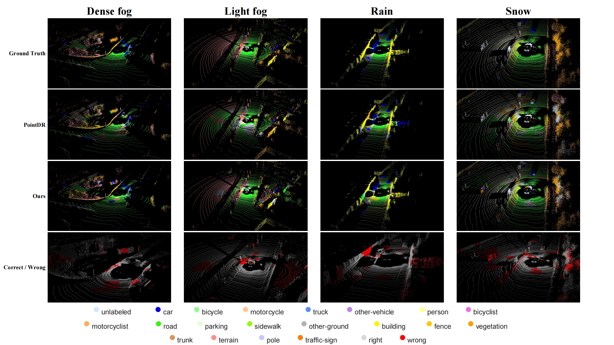

# WeatherMamba

[](https://doi.org/10.5281/zenodo.19231095)
[](LICENSE)

Official implementation of the manuscript:

**Reliable Geometry-Aware Domain Generalisation for LiDAR Point Cloud Semantic Segmentation in Adverse Weather**

This repository is associated with a manuscript submitted to *The Visual Computer*. It provides the model implementation, configuration files, training and evaluation entrypoints, ablation settings, checkpoint download information, and instructions for reproducing the main quantitative and qualitative results.

## Overview

WeatherMamba addresses adverse-weather LiDAR semantic segmentation as a geometry-aware domain generalisation problem. The model is trained on clear-weather or synthetic source-domain point clouds and evaluated on unseen real adverse-weather scenes.

The framework contains four main components:

* **MANF**: Multi-scale Adaptive Neighborhood Fusion for local geometric recovery.
* **RADM**: Reliability-Aware Denoising Module for suppressing unstable weather-induced responses.
* **Hierarchical WeatherMamba Backbone**: selective state-space modelling for efficient long-range contextual learning.
* **WGRG**: Weather-Conditioned Geometry--Reflectance Gating for adaptive feature recalibration.

The manuscript evaluates the following domain generalisation settings:

* **SemanticKITTI → SemanticSTF**
* **SynLiDAR → SemanticSTF**

The target-domain evaluation includes:

* Dense fog
* Light fog
* Rain
* Snow / sleet

## Method Overview <p align="center">  </p> The overall framework combines local geometric recovery, reliability-aware denoising, hierarchical state-space modelling, and weather-conditioned geometry--reflectance recalibration.

## Paper Configuration

The main experiments reported in the manuscript use the following settings:

| Item                            | Value              |
| ------------------------------- | ------------------ |
| Number of semantic classes      | 19                 |
| Number of input points per scan | 32,768             |
| Batch size                      | 4                  |
| Training epochs                 | 50                 |
| Optimizer                       | AdamW              |
| Initial learning rate           | 0.001              |
| Weight decay                    | 0.01               |
| Random seed                     | 42                 |
| Input features                  | x, y, z, intensity |

Please keep the configuration files unchanged when reproducing the reported results.

## Environment

The experiments were developed and tested under the following environment:

* **OS**: Ubuntu 20.04
* **Python**: 3.8
* **PyTorch**: 2.0.1
* **CUDA**: 11.8
* **GPU**: NVIDIA RTX 4090
* **mamba-ssm**: 1.2.2
* **causal-conv1d**: 1.2.2.post1

Create the environment:

```bash
conda create -n weathermamba python=3.8 -y
conda activate weathermamba
```

Install PyTorch with CUDA 11.8:

```bash
pip install torch==2.0.1 torchvision==0.15.2 --index-url https://download.pytorch.org/whl/cu118
```

Install the selective state-space dependencies used for the paper experiments:

```bash
pip install mamba-ssm==1.2.2
pip install causal-conv1d==1.2.2.post1
```

Install the remaining dependencies:

```bash
pip install -r requirements.txt
```

> **Important:** The paper results require the CUDA implementation provided by `mamba-ssm`. 

## Repository Structure

```text
.
├── configs/
│   ├── data.yaml
│   ├── model.yaml
│   ├── train.yaml
│   └── ablations/
│       ├── baseline.yaml
│       ├── manf.yaml
│       ├── manf_radm.yaml
│       ├── radm_wgrg.yaml
│       └── full.yaml
├── scripts/
│   ├── train.py
│   ├── test.py
│   ├── evaluate_miou.py
│   └── visualize_predictions.py
├── weathermamba/
│   ├── cli/
│   ├── data/
│   ├── engine/
│   ├── models/
│   └── utils/
├── checkpoints/
├── figures/
├── outputs/
├── LICENSE
├── requirements.txt
└── README.md
```

## Dataset Preparation

### 1. Download the datasets

The experiments use the following public datasets:

* [SemanticKITTI](https://www.semantic-kitti.org/)
* [SemanticSTF](https://github.com/xiaoaoran/SemanticSTF)
* [SynLiDAR](https://github.com/xiaoaoran/SynLiDAR)

Please follow the terms of use and citation requirements of each dataset.

### 2. Label mapping

The experiments use a unified 19-class semantic label space. The corresponding label mapping files are located under:

```text
configs/label_maps/
```

The raw labels of SemanticKITTI, SemanticSTF, and SynLiDAR should be mapped to the same 19-class training IDs before training and evaluation.

### 3. Expected input format

The current dataset loader recursively scans `.bin` and `.txt` files under each split directory.

Supported point cloud formats:

* `.bin`: each point contains four `float32` values: `x, y, z, intensity`
* `.txt`: the first four columns contain `x, y, z, intensity`; the optional fifth column contains the semantic label

For `.bin` point clouds, label files should use the `.label` suffix and follow a SemanticKITTI-style organization.

### 4. Official dataset directory structures

The original datasets should be organized according to their official release formats.

#### SemanticKITTI

```text
<SEMANTICKITTI_ROOT>/
└── sequences/
    ├── 00/
    │   ├── velodyne/
    │   │   ├── 000000.bin
    │   │   ├── 000001.bin
    │   │   └── ...
    │   ├── labels/
    │   │   ├── 000000.label
    │   │   ├── 000001.label
    │   │   └── ...
    │   ├── calib.txt
    │   ├── poses.txt
    │   └── times.txt
    ├── 01/
    ├── 02/
    └── ...
```

SemanticKITTI uses sequence-based splits rather than separate `train/` and `val/` directories. The sequence split and 19-class learning map should follow the official SemanticKITTI configuration.

#### SemanticSTF

```text
<SEMANTICSTF_ROOT>/
├── train/
│   ├── velodyne/
│   │   ├── 000000.bin
│   │   ├── 000001.bin
│   │   └── ...
│   └── labels/
│       ├── 000000.label
│       ├── 000001.label
│       └── ...
├── val/
│   ├── velodyne/
│   └── labels/
├── test/
│   ├── velodyne/
│   └── labels/
└── semanticstf.yaml
```

SemanticSTF should remain in its official `train/`, `val/`, and `test/` organization. Weather-wise evaluation is performed through the evaluation protocol and metadata rather than by reorganizing the dataset into separate weather folders.

#### SynLiDAR

```text
<SYNLIDAR_ROOT>/
├── 00/
│   ├── velodyne/
│   │   ├── 000000.bin
│   │   ├── 000001.bin
│   │   └── ...
│   └── labels/
│       ├── 000000.label
│       ├── 000001.label
│       └── ...
├── 01/
├── 02/
├── ...
├── 12/
├── annotations.yaml
└── read_data.py
```

SynLiDAR is released as numbered sequences. The source-domain training split used in this repository should be defined in the corresponding configuration file.

## Configuration Files

The main configuration files are:

* `configs/train.yaml`: training schedule, optimizer, random seed, logging, and checkpoint settings
* `configs/data.yaml`: dataset path, number of points, batch size, workers, split names, and augmentation settings
* `configs/model.yaml`: number of classes, hidden dimension, stage depths, neighborhood sizes, and module settings

The paper configuration should contain:

```yaml
# configs/train.yaml
seed: 42
epochs: 50
lr: 0.001
weight_decay: 0.01
```

```yaml
# configs/data.yaml
num_points: 32768

loading:
  batch_size: 4
```

```yaml
# configs/model.yaml
num_classes: 19
use_manf: true
use_radm: true
use_wgrg: true
```

## Checkpoints for Interface Validation

| Setting                     | Checkpoint                              | Download                                                                | Extraction code |
| --------------------------- | --------------------------------------- | ----------------------------------------------------------------------- | --------------- |
| SemanticKITTI → SemanticSTF | `semantickitti_to_semanticstf.pth` | [Baidu Cloud](https://pan.baidu.com/s/1rUFKV6KteybMdin3YY96UQ?pwd=jy89) | `jy89`          |
| SynLiDAR → SemanticSTF      | `synlidar_to_semanticstf.pth`      | [Baidu Cloud](https://pan.baidu.com/s/1NWkHWJm8olgeMPq_k_-V4Q?pwd=bmbs) | `bmbs`          |

Place downloaded checkpoint files under:

```text
checkpoints/
```

## Quick Dry Run

A dry run verifies that the dataset, model, and environment can be loaded correctly.

```bash
python scripts/train.py \
    --dataset-path /path/to/prepared/SemanticKITTI \
    --model-config configs/model.yaml \
    --data-config configs/data.yaml \
    --train-config configs/train.yaml \
    --num-classes 19 \
    --num-points 32768 \
    --batch-size 4 \
    --dry-run
```

## Reproducing the Main Results

### 1. SemanticKITTI → SemanticSTF

Train the model on the prepared SemanticKITTI source-domain training set:

```bash
python scripts/train.py \
    --dataset-path /path/to/prepared/SemanticKITTI \
    --model-config configs/model.yaml \
    --data-config configs/data.yaml \
    --train-config configs/train.yaml \
    --experiment-name semantickitti_source_seed42 \
    --epochs 50 \
    --batch-size 4 \
    --num-points 32768 \
    --num-classes 19 \
    --seed 42
```

Evaluate the trained checkpoint on SemanticSTF:

```bash
python scripts/test.py \
    --dataset-path /path/to/prepared/dataset_root \
    --target-dataset SemanticSTF \
    --checkpoint checkpoints/semantickitti_to_semanticstf.pth \
    --model-config configs/model.yaml \
    --data-config configs/data.yaml \
    --train-config configs/train.yaml \
    --experiment-name semantickitti_to_semanticstf \
    --num-points 32768 \
    --num-classes 19 \
    --seed 42
```

Compute the official 19-class mIoU:

```bash
python scripts/evaluate_miou.py \
    --prediction-dir outputs/weathermamba_pro/semantickitti_to_semanticstf/predictions \
    --num-classes 19
```

Expected manuscript result:

```text
SemanticKITTI → SemanticSTF: 35.8% mIoU
```

### 2. SynLiDAR → SemanticSTF

Train the model on the prepared SynLiDAR source-domain training set:

```bash
python scripts/train.py \
    --dataset-path /path/to/prepared/SynLiDAR \
    --model-config configs/model.yaml \
    --data-config configs/data.yaml \
    --train-config configs/train.yaml \
    --experiment-name synlidar_source_seed42 \
    --epochs 50 \
    --batch-size 4 \
    --num-points 32768 \
    --num-classes 19 \
    --seed 42
```

Evaluate the trained checkpoint on SemanticSTF:

```bash
python scripts/test.py \
    --dataset-path /path/to/prepared/dataset_root \
    --target-dataset SemanticSTF \
    --checkpoint checkpoints/synlidar_to_semanticstf.pth \
    --model-config configs/model.yaml \
    --data-config configs/data.yaml \
    --train-config configs/train.yaml \
    --experiment-name synlidar_to_semanticstf \
    --num-points 32768 \
    --num-classes 19 \
    --seed 42
```

Compute the official 19-class mIoU:

```bash
python scripts/evaluate_miou.py \
    --prediction-dir outputs/weathermamba_pro/synlidar_to_semanticstf/predictions \
    --num-classes 19
```

Expected manuscript result:

```text
SynLiDAR → SemanticSTF: 23.5% mIoU
```


## Qualitative Results <p align="center">  </p> The qualitative comparison presents representative segmentation results under dense fog, light fog, rain, and snow conditions.

### 3. Weather-wise evaluation

Evaluate the SemanticKITTI-trained checkpoint on the four SemanticSTF weather subsets:

```bash
python scripts/test.py \
    --dataset-path /path/to/prepared/dataset_root/SemanticSTF \
    --checkpoint checkpoints/semantickitti_to_semanticstf.pth \
    --subset dense_fog \
    --model-config configs/model.yaml \
    --data-config configs/data.yaml \
    --train-config configs/train.yaml \
    --num-points 32768 \
    --num-classes 19
```

```bash
python scripts/test.py \
    --dataset-path /path/to/prepared/dataset_root/SemanticSTF \
    --lasses 19
```

The expected weather-wise results are:

| Dense fog | Light fog | Rain | Snow | Overall |
| --------- | --------- | ---- | ---- | ------- |
| 37.1      | 31.9      | 32.6 | 31.8 | 35.8    |

## Reproducing the Ablation Study

The ablation study evaluates the contributions of MANF, RADM, and WGRG.

Prepare the following model configuration files:

| Configuration                      | MANF  | RADM  | WGRG  |
| ---------------------------------- | ----- | ----- | ----- |
| `configs/ablations/baseline.yaml`  | false | false | false |
| `configs/ablations/manf.yaml`      | true  | false | false |
| `configs/ablations/manf_radm.yaml` | true  | true  | false |
| `configs/ablations/radm_wgrg.yaml` | false | true  | true  |
| `configs/ablations/full.yaml`      | true  | true  | true  |

Example configuration:

```yaml
num_classes: 19
input_dim: 4
hidden_dim: 384
d_state: 16
d_conv: 4
expand: 2.0
num_weather_types: 4
k_small: 8
k_medium: 16
k_large: 32
stage_depths: [2, 2, 2]
dropout: 0.1
use_deep_supervision: true

use_manf: true
use_radm: true
use_wgrg: true
```

Train each ablation configuration using the same source-domain data and training settings:

```bash
python scripts/train.py \
    --dataset-path /path/to/prepared/SemanticKITTI \
    --model-config configs/ablations/<ABLATION_CONFIG>.yaml \
    --data-config configs/data.yaml \
    --train-config configs/train.yaml \
    --experiment-name <ABLATION_RUN_NAME> \
    --epochs 50 \
    --batch-size 4 \
    --num-points 32768 \
    --num-classes 19 \
    --seed 42
```

Evaluate each checkpoint on SemanticSTF using the same evaluation protocol described above.

The expected ablation results are:

| Method                 | Dense fog | Light fog | Rain | Snow | mIoU |
| ---------------------- | --------: | --------: | ---: | ---: | ---: |
| Baseline               |      31.2 |      27.4 | 29.1 | 24.6 | 29.4 |
| Baseline + MANF        |      33.5 |      29.2 | 30.8 | 27.1 | 31.8 |
| Baseline + MANF + RADM |      34.6 |      29.8 | 31.7 | 28.5 | 32.6 |
| Baseline + RADM + WGRG |      34.8 |      30.1 | 31.6 | 28.7 | 32.9 |
| Full model             |      37.1 |      31.9 | 32.6 | 31.8 | 35.8 |

## Reproducing the Qualitative Visualisations

The qualitative visualisations in the manuscript are generated from predictions saved by the evaluation script.

Run evaluation with `--save-predictions`:

```bash
python scripts/test.py \
    --dataset-path /path/to/prepared/dataset_root \
    --target-dataset SemanticSTF \
    --checkpoint checkpoints/semantickitti_to_semanticstf.pth \
    --model-config configs/model.yaml \
    --data-config configs/data.yaml \
    --train-config configs/train.yaml \
    --experiment-name semanticstf_visualisation \
    --num-points 32768 \
    --num-classes 19 \
    --save-predictions
```

Saved prediction files are written to:

```text
outputs/weathermamba_pro/semanticstf_visualisation/predictions/
```

Each saved prediction file contains:

```text
file_path
prediction
```

Generate colour-coded semantic predictions and correctness maps:

```bash
python scripts/visualize_predictions.py \
    --prediction-dir outputs/weathermamba_pro/semanticstf_visualisation/predictions \
    --output-dir outputs/weathermamba_pro/semanticstf_visualisation/visualisations
```

## Outputs

Training outputs are saved to:

```text
outputs/weathermamba_pro/<run_name>/
├── checkpoints/
├── logs/
├── model_resolved.yaml
├── data_resolved.yaml
└── train_resolved.yaml
```

Evaluation outputs are saved to:

```text
outputs/weathermamba_pro/<evaluation_name>/
├── predictions/
├── metrics.yaml
├── model_resolved.yaml
├── data_resolved.yaml
└── train_resolved.yaml
```

## Notes on Reproducibility

To improve reproducibility:

* Use the exact environment versions listed above.
* Use the same 19-class label mapping for all datasets.
* Keep the paper configuration files unchanged.
* Verify the prepared dataset structure before training.
* Evaluate the exact checkpoint corresponding to each reported experiment.
* Use the official evaluation protocol when computing mIoU.
* Record resolved configuration files and logs for every run.

## Citation

If you find this repository useful, please cite:

```bibtex
@misc{weathermamba2026,
  title     = {Reliable Geometry-Aware Domain Generalisation for LiDAR Point Cloud Semantic Segmentation in Adverse Weather},
  author    = {He Huang and Xintai Zhang and Yidan Zhang and Junxing Yang and Yu Liang},
  year      = {2026},
  note      = {Manuscript submitted to The Visual Computer and associated code release},
  doi       = {10.5281/zenodo.19231095},
  url       = {https://doi.org/10.5281/zenodo.19231095}
}
```

## License

This project is released under the MIT License. See [LICENSE](LICENSE) for details.

## Data Acknowledgements

Please cite the original dataset papers and follow their licences when using SemanticKITTI, SemanticSTF, and SynLiDAR.

```bibtex
@inproceedings{behley2019iccv,
  author    = {J. Behley and M. Garbade and A. Milioto and J. Quenzel and S. Behnke and C. Stachniss and J. Gall},
  title     = {{SemanticKITTI: A Dataset for Semantic Scene Understanding of LiDAR Sequences}},
  booktitle = {Proceedings of the IEEE/CVF International Conference on Computer Vision},
  year      = {2019}
}

@article{xiao20233d,
  title   = {3D Semantic Segmentation in the Wild: Learning Generalized Models for Adverse-Condition Point Clouds},
  author  = {Xiao, Aoran and Huang, Jiaxing and Xuan, Weihao and Ren, Ruijie and Liu, Kangcheng and Guan, Dayan and El Saddik, Abdulmotaleb and Lu, Shijian and Xing, Eric},
  journal = {arXiv preprint arXiv:2304.00690},
  year    = {2023}
}

@inproceedings{bijelic2020seeing,
  title     = {Seeing through Fog without Seeing Fog: Deep Multimodal Sensor Fusion in Unseen Adverse Weather},
  author    = {Bijelic, Mario and Gruber, Tobias and Mannan, Fahim and Kraus, Florian and Ritter, Werner and Dietmayer, Klaus and Heide, Felix},
  booktitle = {Proceedings of the IEEE/CVF Conference on Computer Vision and Pattern Recognition},
  pages     = {11682--11692},
  year      = {2020}
}

@inproceedings{xiao2022transfer,
  title     = {Transfer Learning from Synthetic to Real LiDAR Point Cloud for Semantic Segmentation},
  author    = {Xiao, Aoran and Huang, Jiaxing and Guan, Dayan and Zhan, Fangneng and Lu, Shijian},
  booktitle = {Proceedings of the AAAI Conference on Artificial Intelligence},
  volume    = {36},
  number    = {3},
  pages     = {2795--2803},
  year      = {2022}
}
```
